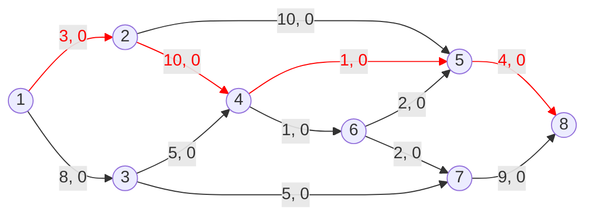
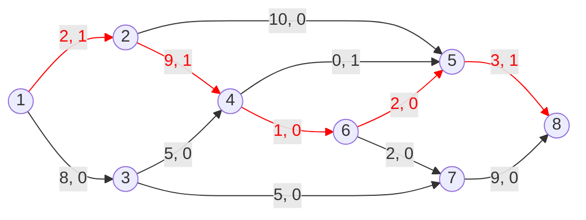
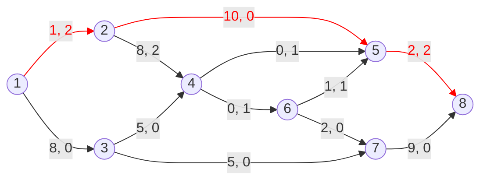
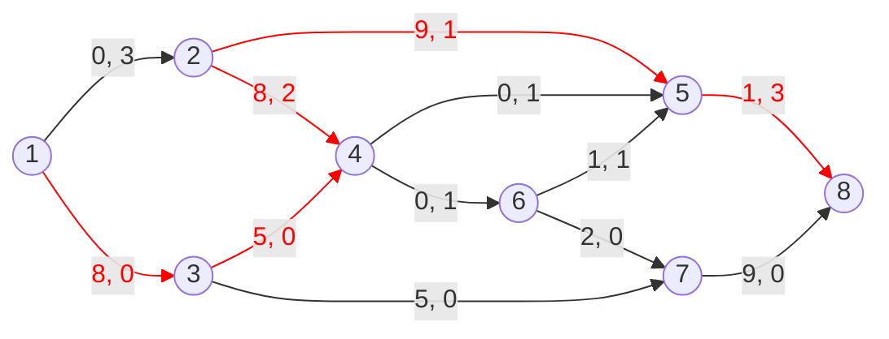
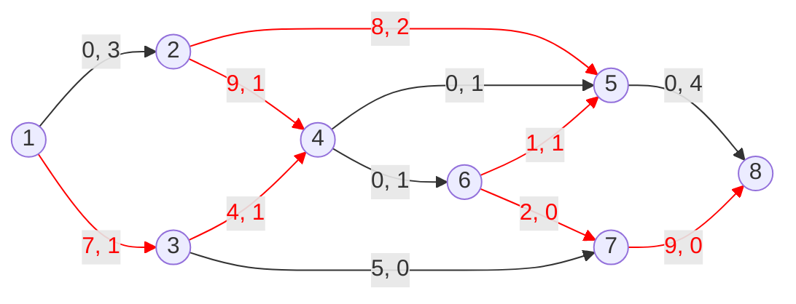
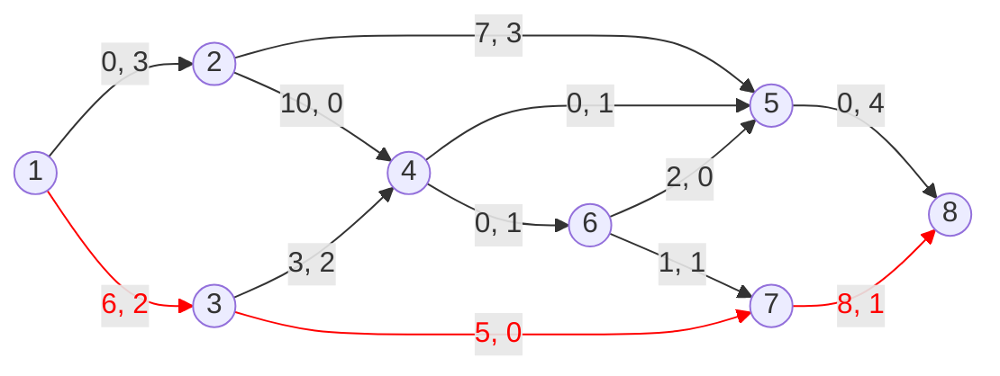
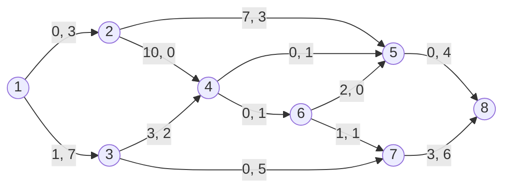

# Problem 2

沿着增广路 $P_1: 1 \to 2 \to 4 \to 5 \to 8$，可增加流量 $\delta(P_1) = 1$：

沿着增广路 $P_2: 1 \to 2 \to 4 \to 6 \to 5 \to 8$，可增加流量 $\delta(P_2) = 1$：

沿着增广路 $P_3: 1 \to 2 \to 5 \to 8$，可增加流量 $\delta(P_3) = 1$：

沿着增广路 $P_4: 1 \to 3 \to 4 \to 2 \to 5 \to 8$，可增加流量 $\delta(P_4) = 1$：

沿着增广路 $P_5: 1 \to 3 \to 4 \to 2 \to 5 \to 6 \to 7 \to 8$，可增加流量 $\delta(P_5) = 1$：

沿着增广路 $P_6: 1 \to 3 \to 7 \to 8$，可增加流量 $\delta(P_6) = 5$：

最后的结果如下图所示，此时无法再找到增广路，因此最大流为 $10$。

对应的割为

$$
\mathcal{C} = \{(1, 2), (3, 7), (4, 5), (4, 6)\}
$$
