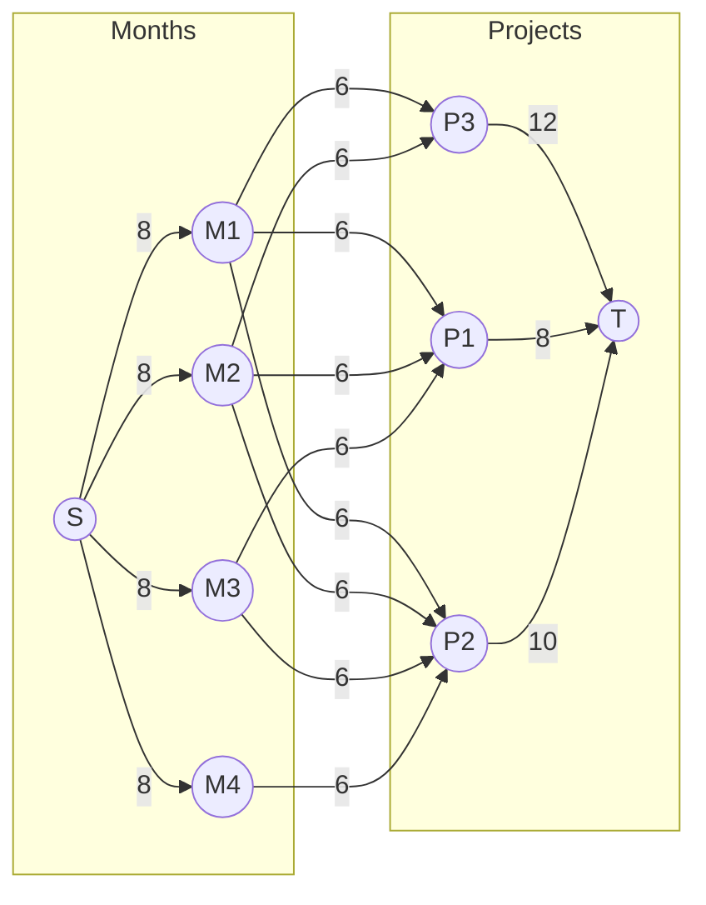

# Problem 3

## 问题建模

> 假设在接下来的 $m$ 个月内，需要完成 $n$ 个项目。第 $i$ 个项目需要在 $t_i$ 个月内完成，总计需要 $l_i$ 个工时（人·月）。
>
> 每个月共有 $L$ 名工人可用，且每个项目每月最多只能分配 $N$ 名工人。问是否能够按时完成所有项目。

我们可以通过构建一个网络流模型来解决该问题。新建一个虚拟的源点 $S$ 和汇点 $T$，并根据以下规则构建网络：

- 对于 $\forall i \in [1, m]$，连接 $(S, M_i)$，容量为 $L$，表示每个月最多可以分配 $L$ 名工人。
- 对于 $\forall i \in [1, n]$，$\forall j \in [1, t_i]$，连接 $(M_j, P_i)$，容量为 $N$，表示每个项目每月最多只能分配 $N$ 名工人。
- 对于 $\forall i \in [1, n]$，连接 $(P_i, T)$，容量为 $l_i$，表示每个项目需要的总工时。

最后，通过检查网络的最大流是否等于 $\sum_{i=1}^{n} l_i$，即可判断是否能够按时完成所有项目。

对于示例中的情况，建模得到的网络如下所示：



最后，检查最大流是否为 $30$（即 $\sum_{i=1}^{n} l_i$）。如果最大流等于 $30$，说明所有项目都可以按时完成。

## 安装与运行

首先，新建虚拟环境：

```bash
python -m venv .venv
```

然后，激活虚拟环境。在 Windows 下，使用如下命令：

```bash
.venv\Scripts\activate
```

在 Linux 或者 macOS 下，使用如下命令：

```bash
source .venv/bin/activate
```

进入虚拟环境后，安装依赖：

```bash
pip install -r requirements.txt
```

最后，指定输入文件与输出文件后，运行程序：

```bash
python main.py -i <input-file>
```

## 输入格式与输出格式

在 `data` 目录下有 `input.xlsx` 这个文件，为输入示例。

### 输入格式

输入的格式如下图所示，是一个 Excel 文件，需要填写 $n, m, L, N$ 的值，以及每一个项目的 $t$ 和 $l$。


### 输出格式

输出一个字符串。

- 当能够按时完成所有项目时，输出 `True`。
- 当不能按时完成所有项目时，输出 `False`。
