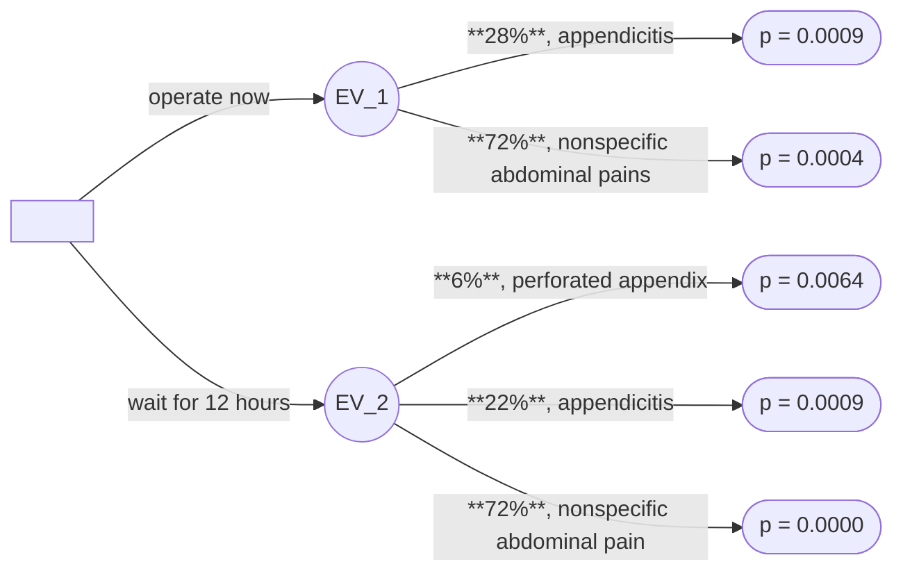

# Problem 2

画出决策树如下：

由图知，若选择立即做手术，则患者死亡概率为

$$
\text{EV}_1 = 28\% \times 0.0009 + 72\% \times 0.0004 = 5.4 \times 10^{-4}
$$

若选择等待 $12$ 小时后再做手术，则患者死亡概率为

$$
\text{EV}_2 = 6\% \times 0.0064 + 22\% \times 0.0009 + 72\% \times 0.0000 = 5.82 \times 10^{-4}
$$

由于 $5.4 \times 10^{-4} < 5.82 \times 10^{-4}$，故应当选择立即做手术。
